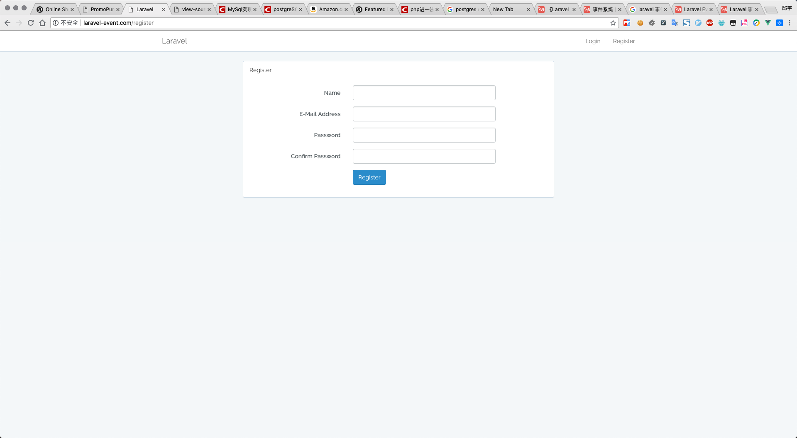
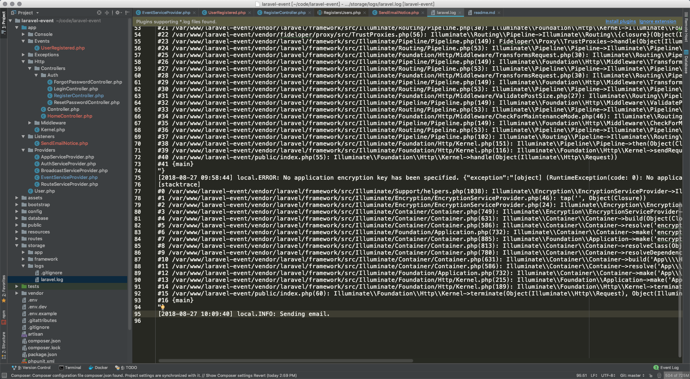

# Laravel Event

`laravel-event/app/Providers/EventServiceProvider.php`

```php
<?php

namespace App\Providers;

use Illuminate\Support\Facades\Event;
use Illuminate\Foundation\Support\Providers\EventServiceProvider as ServiceProvider;

class EventServiceProvider extends ServiceProvider
{
    /**
     * The event listener mappings for the application.
     *
     * @var array
     */
    protected $listen = [
        // 用户注册成功了, 则发送邮件通知.
        'App\Events\UserRegistered' => [
            'App\Listeners\SendEmailNotice',
        ],
    ];

    /**
     * Register any events for your application.
     *
     * @return void
     */
    public function boot()
    {
        parent::boot();

        //
    }
}

```


```shell
root@5c9598078ab8:/var/www/laravel-event# php artisan event:generate
Events and listeners generated successfully!
root@5c9598078ab8:/var/www/laravel-event#
```

通过 git, 可以看到新增了 2 个文件.

```shell
root@5c9598078ab8:/var/www/laravel-event# git status
On branch master
Changes not staged for commit:
  (use "git add <file>..." to update what will be committed)
  (use "git checkout -- <file>..." to discard changes in working directory)

	modified:   app/Providers/EventServiceProvider.php
	modified:   readme.md

Untracked files:
  (use "git add <file>..." to include in what will be committed)

	app/Events/
	app/Listeners/

no changes added to commit (use "git add" and/or "git commit -a")
root@5c9598078ab8:/var/www/laravel-event#
```

把要执行的代码写在这里. 这个就是观察者.

```php
<?php

namespace App\Listeners;

use App\Events\UserRegistered;
use Illuminate\Queue\InteractsWithQueue;
use Illuminate\Contracts\Queue\ShouldQueue;

class SendEmailNotice
{
    /**
     * Create the event listener.
     *
     * @return void
     */
    public function __construct()
    {
        //
    }

    /**
     * Handle the event.
     *
     * @param  UserRegistered  $event
     * @return void
     */
    public function handle(UserRegistered $event)
    {
        // 记录到日志.
        info('Sending email.');
    }
}
```


使用 laravel 封装好的注册登录.

```shell
root@5c9598078ab8:/var/www/laravel-event# php artisan make:auth
Authentication scaffolding generated successfully.
```

注册完毕以后. 触发 event.

*app/Http/Controllers/Auth/RegisterController.php*
```php
    /**
     * The user has been registered.
     * 用户注册完毕.
     *
     * @param  \Illuminate\Http\Request  $request
     * @param  mixed  $user
     * @return mixed
     */
    protected function registered(Request $request, $user)
    {
        event(new UserRegistered());
    }
```

数据迁移

```shell
root@5c9598078ab8:/var/www/laravel-event# php artisan migrate
Migration table created successfully.
Migrating: 2014_10_12_000000_create_users_table
Migrated:  2014_10_12_000000_create_users_table
Migrating: 2014_10_12_100000_create_password_resets_table
Migrated:  2014_10_12_100000_create_password_resets_table
root@5c9598078ab8:/var/www/laravel-event#
```

打开项目网站. 注册一个用户.




然后查看日志.

`laravel-event/storage/logs/laravel.log`



可以看到. 最后一行, 就是我们要执行的代码. ok. 搞定.
